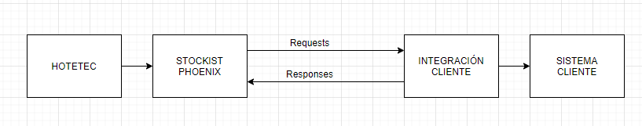

# Introducción

Stockist Phoenix es un api de publicación PUSH de precios e inventario y notificación de reservas.

Para ello el cliente deberá tratar los mensajes explicados en este documento, para poder realizar la carga de precios e inventario correctamente en su sistema.

Todos los mensajes (excepto la notificación de reservas) siguen este esquema de flujo.

Para la notificación de reservas será el cliente quien realice una petición/notificación al webservice de Stockist Phoenix para notificar la creación, modificación o cancelación de una reserva que se haya producido en el sistema del cliente. 

La comunicación de todos los mensajes se realizarán mediante HTTP RAW, es decir, el envio es mediante un POST sobre HTTP pero con un body en formato texto XML.

Para descargar una colección de mensajes de ejemplo para la aplicación [POSTMAN](https://www.postman.com/) puede clicar [aqui](https://www.google.es/)

También puede descargar las xsd de los mensajes del protocolo en este enlace 
(https://www.google.es)
Para la generación de las xsd revise el archivo PhoenixSchema.xsd que es la raíz de todo el esquema. 
Se ha usado JAXB para la generación de objetos en Java.

Las ip's de la plataforma de Hotetec son las siguientes: 
- OFICINA: 
- TEST : 195.235.100.35
- LIVE : 52.16.198.42